# 🔐 Sécurisation d'un compte AWS Free Tier


## 📋 Objectif du projet

Mettre en place les bonnes pratiques de sécurité et de gouvernance sur un compte AWS existant, conformément aux recommandations du **AWS Well-Architected Framework**.

Ce projet démontre qu'une infrastructure cloud sécurisée commence **avant même le premier déploiement**. Il constitue le socle de tous les projets AWS qui suivront.

---

## 🧠 Compétences démontrées

- Sécurisation d'un compte root AWS
- Gestion des identités et accès (IAM)
- Principe du moindre privilège
- Gouvernance et contrôle des coûts
- Audit et traçabilité avec CloudTrail

---

## 🏗️ Architecture de sécurité mise en place
```
Compte AWS
│
├── Root (coffre-fort — usage exceptionnel uniquement)
│   └── MFA activé
│
├── IAM Admin — admin-cyber (usage quotidien)
│   ├── MFA activé
│   ├── Politique AdministratorAccess
│   └── URL de connexion personnalisée
│
├── Billing
│   ├── Zero-Spend Budget — alerte dès 0,01$
│   └── Cost Explorer activé
│
└── CloudTrail — trail-admin-cyber
    └── Logs stockés dans bucket S3 dédié (eu-west-3)
```

---

## 📌 Étapes de configuration

### Étape 1 — Configuration initiale du compte AWS

> **Pourquoi :** Avant toute chose, on vérifie que le compte est correctement configuré avec la bonne région de travail. La région **Europe (Paris) eu-west-3** est privilégiée pour réduire la latence et rester dans la législation européenne (RGPD). Une carte virtuelle avec plafond bas est utilisée pour se protéger contre toute erreur de facturation accidentelle.

- Connexion au compte AWS avec le compte root
- Sélection de la région **Europe (Paris) eu-west-3**
- Carte virtuelle avec plafond bas associée au compte (Revolut / Lydia)

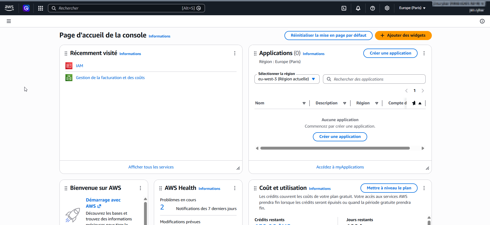

---

### Étape 2 — Sécurisation du compte Root

> **Pourquoi :** Le compte root est la cible prioritaire des attaquants. Sans MFA, un simple vol de mot de passe suffit à compromettre l'intégralité du compte AWS. Le MFA ajoute une deuxième couche d'authentification qui rend l'accès non autorisé quasi impossible. AWS confirme la bonne configuration via son tableau de bord IAM avec **0 recommandation de sécurité en attente**.

- MFA activé sur le compte root (Google Authenticator / Authy)
- Aucune clé d'accès active sur le compte root

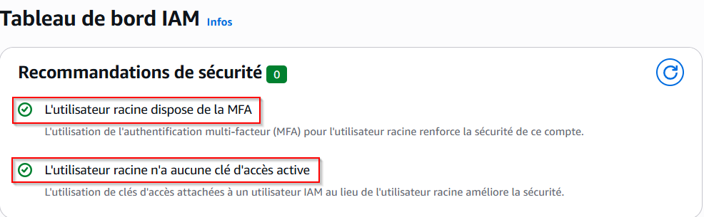

---

### Étape 3 — Renforcement de la politique de mot de passe

> **Pourquoi :** La politique de mot de passe par défaut d'AWS est insuffisante (8 caractères minimum). On la renforce pour qu'elle s'applique à tous les utilisateurs IAM du compte. Une longueur minimale de 14 caractères, une expiration à 90 jours et l'interdiction de réutilisation des 5 derniers mots de passe réduisent considérablement le risque de compromission par force brute ou réutilisation de credentials.

- Longueur minimale portée à **14 caractères**
- Majuscules, minuscules, chiffres et caractères spéciaux requis
- Expiration du mot de passe tous les **90 jours**
- Interdiction de réutilisation des **5 derniers mots de passe**

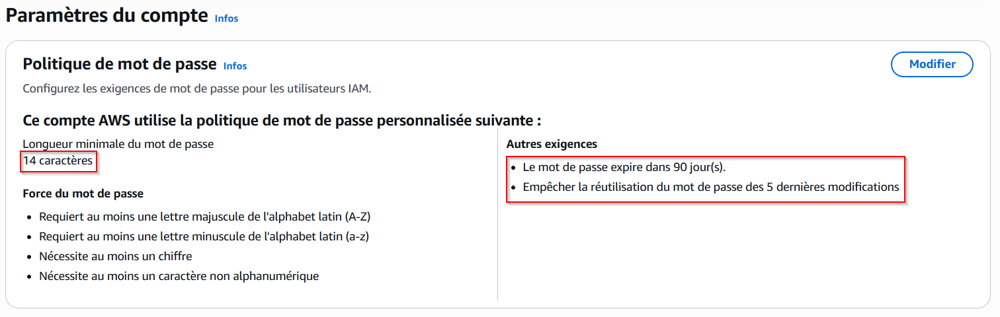

---

### Étape 4 — Configuration de l'utilisateur IAM Admin

> **Pourquoi :** C'est le principe du moindre privilège appliqué à la gestion du compte. Le root ne doit servir qu'en dernier recours. Pour toutes les opérations quotidiennes, on utilise un utilisateur IAM dédié **admin-cyber** dont les actions sont traçables et auditables, contrairement au root. Le MFA est également activé sur cet utilisateur pour une double protection.

- Utilisateur IAM **admin-cyber** avec politique **AdministratorAccess**
- MFA activé sur l'utilisateur IAM
- Accès console activé avec authentification MFA

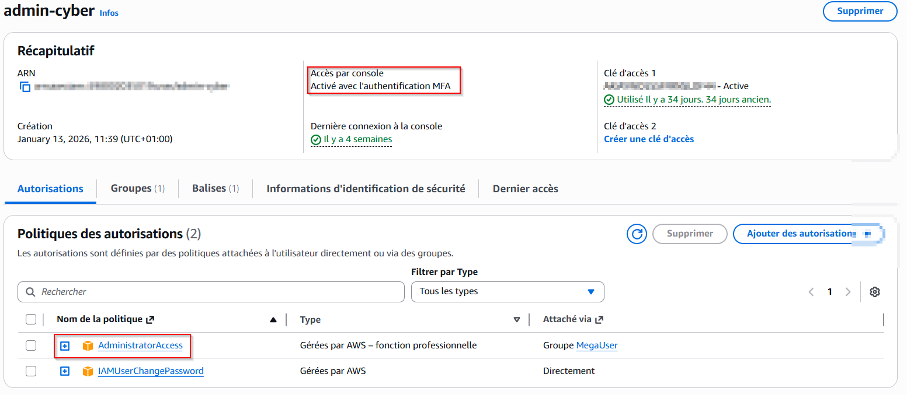

---

### Étape 5 — URL de connexion IAM personnalisée

> **Pourquoi :** L'URL de connexion IAM personnalisée permet aux utilisateurs IAM de se connecter sans passer par le compte root. Elle remplace le numéro de compte à 12 chiffres par une URL dédiée, plus simple à utiliser et plus professionnelle.

- URL de connexion IAM configurée pour le compte

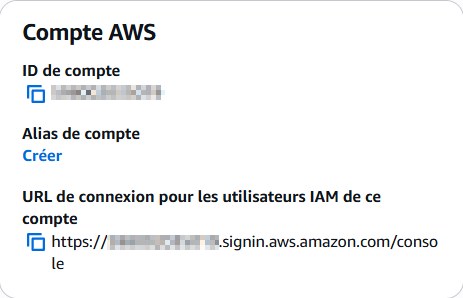

---

### Étape 6 — Déconnexion Root / Connexion IAM Admin

> **Pourquoi :** À partir de ce moment, le compte root est mis en "coffre-fort". Ne plus l'utiliser au quotidien réduit drastiquement la surface d'attaque. En cas de compromission de l'utilisateur IAM admin, le root reste intact et permet de reprendre le contrôle du compte.

- Déconnexion du compte root
- Reconnexion avec l'utilisateur IAM **admin-cyber**
- ⚠️ **Le compte root ne sera plus utilisé après cette étape**

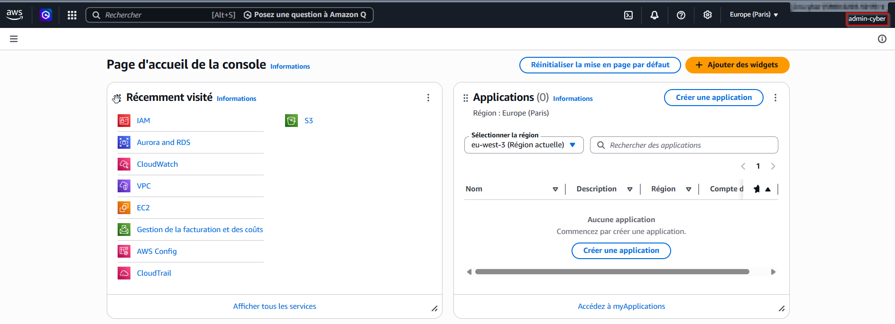

---

### Étape 7 — Zero-Spend Budget et alerte de facturation

> **Pourquoi :** AWS facture à l'usage. Une erreur de configuration, une instance oubliée ou une attaque de type cryptojacking peuvent générer des coûts importants en quelques heures. Un Zero-Spend Budget avec alerte dès **0,01$** permet d'être prévenu immédiatement à la moindre dépense. C'est le filet de sécurité financier le plus strict possible pour un compte de formation.

- Zero-Spend Budget mensuel à **1$** configuré
- Alerte email déclenchée dès **0,01$** dépensé (1% du budget)

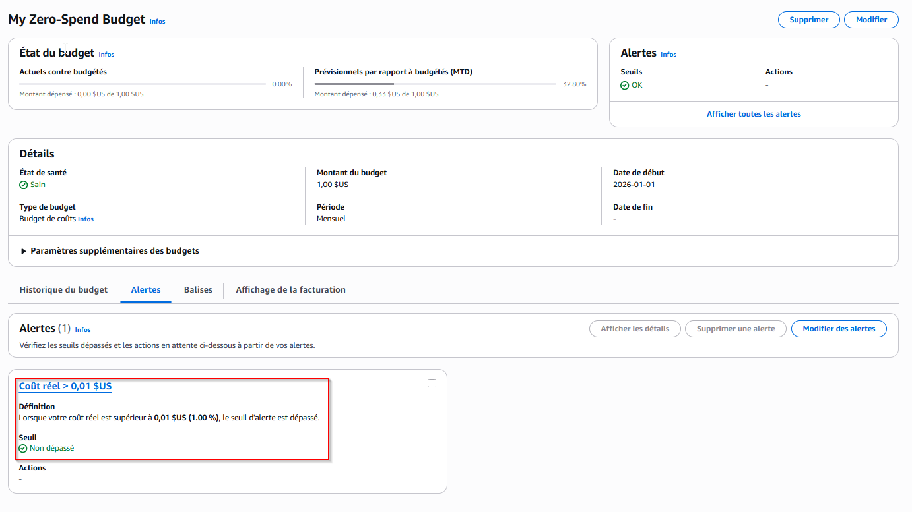

---

### Étape 8 — Activation et configuration de CloudTrail

> **Pourquoi :** CloudTrail enregistre toutes les actions effectuées sur le compte AWS — qui a fait quoi, quand, depuis quelle adresse IP. C'est l'équivalent d'un journal d'audit. En cas d'incident de sécurité, CloudTrail permet de retracer exactement ce qui s'est passé. La journalisation multirégion garantit qu'aucune action n'échappe à l'audit, quelle que soit la région utilisée.

- Trail **trail-admin-cyber** créé et actif
- Journalisation activée sur **toutes les régions**
- Logs stockés dans un bucket S3 dédié en **eu-west-3**

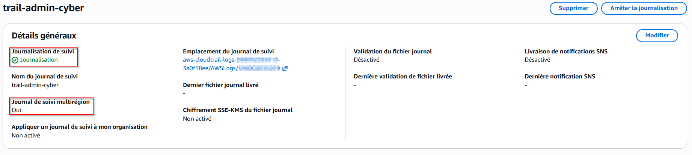
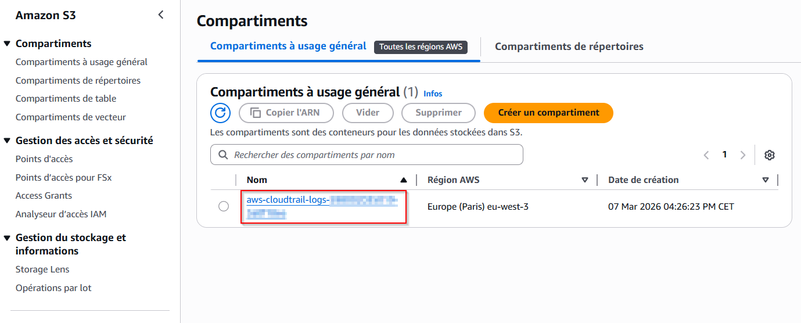

---

### Étape 9 — Activation de Cost Explorer

> **Pourquoi :** Cost Explorer offre une visualisation détaillée des coûts AWS par service, par région et par période. Couplé au Zero-Spend Budget, il permet de comprendre précisément l'origine des coûts et d'optimiser les dépenses. Indispensable pour tout ingénieur cloud qui gère des ressources.

- Cost Explorer activé depuis **Billing → Explorateur de coûts**
- Visualisation des coûts par service disponible

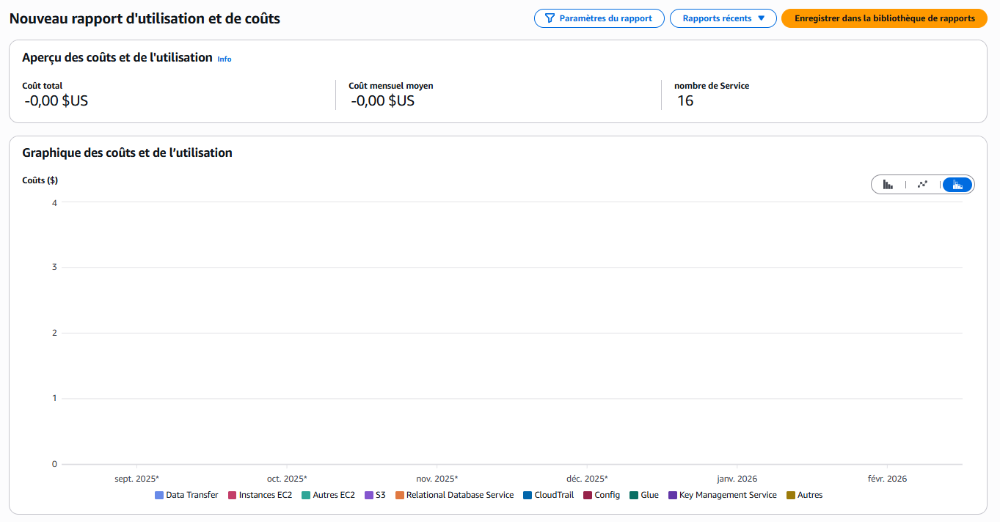

---

### Étape 10 — Vérification finale

> **Pourquoi :** AWS fournit dans le tableau de bord IAM une liste de recommandations de sécurité. Vérifier que toutes sont au vert confirme que la configuration est conforme aux bonnes pratiques AWS. Le compteur à **0 recommandation** valide l'ensemble de la démarche.

- Vérification dans **IAM → Tableau de bord**
- **0 recommandation de sécurité** en attente ✅
- MFA root ✅, MFA IAM ✅, aucune clé d'accès inutilisée ✅

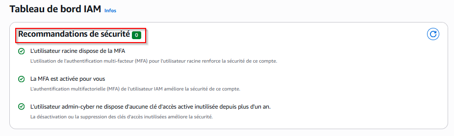

---

## ✅ Résultat

| Élément | Statut |
|---|---|
| Région de travail | ✅ Europe (Paris) eu-west-3 |
| MFA Root | ✅ Activé |
| Politique de mot de passe | ✅ Renforcée (14 car. / 90j / 5 derniers) |
| Utilisateur IAM Admin | ✅ admin-cyber |
| MFA IAM Admin | ✅ Activé |
| Root mis en coffre-fort | ✅ |
| Zero-Spend Budget | ✅ Alerte dès 0,01$ |
| CloudTrail | ✅ Actif multirégion |
| Bucket S3 logs | ✅ eu-west-3 |
| Cost Explorer | ✅ Activé |
| Recommandations IAM | ✅ 0 en attente |

---

## 🔗 Projets suivants

- [Projet 02 — VPC Multi-AZ via console AWS](#) *(à venir)*
- [Projet 03 — VPC Multi-AZ en Terraform](#) *(à venir)*

---

## 👤 Auteur

**Jimmy Barbier**
Cloud Engineer AWS | Sécurité Cloud | Remote

[](https://www.linkedin.com/in/jimmy-barbier-89740539a/)
[](https://jimmy-barbier.github.io/portfolio/)
